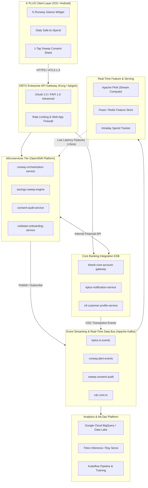
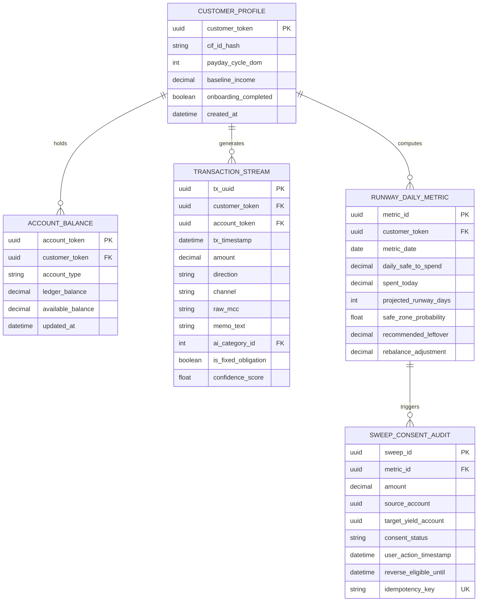
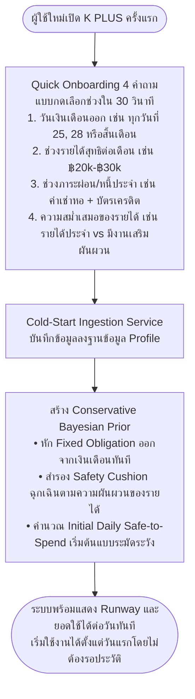
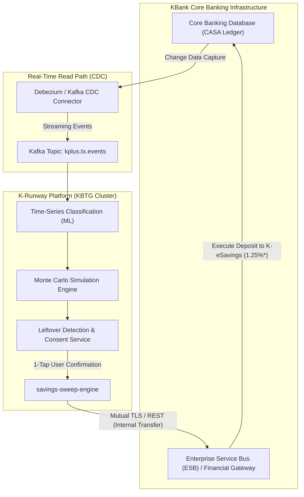

# เอกสารสถาปัตยกรรมทางเทคนิคและโครงสร้างข้อมูล (Technical & Data Architecture)
## โครงการ K-Runway & Predictive Auto-Saving (K PLUS Innovation)
> **สำหรับ:** การแข่งขัน KBTG Hackathon  
> **หัวข้อ:** นวัตกรรมระบบบริหารจัดการสภาพคล่องและการออมเชิงรุกสำหรับ First Jobbers บน K PLUS

---

## สารบัญ
1. [ภาพรวมของสถาปัตยกรรมระบบ (System Architecture Overview)](#1-ภาพรวมของสถาปัตยกรรมระบบ-system-architecture-overview)
2. [โครงสร้างข้อมูลและพจนานุกรมข้อมูล (Data Architecture & Data Dictionary)](#2-โครงสร้างข้อมูลและพจนานุกรมข้อมูล-data-architecture--data-dictionary)
   - 2.1 ข้อมูลที่ระบบต้องใช้ (Data Ingestion Pipeline)
   - 2.2 โครงสร้าง Entity-Relationship และ Data Models
   - 2.3 การจัดการ Cold Start Data สำหรับบัญชีเปิดใหม่
   - 2.4 ความปลอดภัยของข้อมูลและ PDPA (Data Governance & Privacy)
3. [สถาปัตยกรรมระบบและส่วนประกอบ (System Components & Tech Stack)](#3-สถาปัตยกรรมระบบและส่วนประกอบ-system-components--tech-stack)
   - 3.1 Client Tier (K PLUS Mobile Application)
   - 3.2 API Gateway & Security Gateway Tier
   - 3.3 Microservices & Business Logic Tier
   - 3.4 Data & AI / MLOps Platform Tier
   - 3.5 Storage & Caching Layer
4. [การเชื่อมต่อกับระบบและฐานข้อมูลเดิมของ KBank (Integration Architecture)](#4-การเชื่อมต่อกับระบบและฐานข้อมูลเดิมของ-kbank-integration-architecture)
   - 4.1 การเชื่อมต่อกับ Core Banking System (CASA Ledger)
   - 4.2 การดึงข้อมูลแบบ Real-time ด้วย Change Data Capture (CDC) และ Kafka
   - 4.3 การส่งคำสั่งโอนเงิน (Sweeping) ผ่าน Financial Transaction API / ESB
   - 4.4 การเชื่อมต่อกับ Customer Information File (CIF) และ Enterprise Notification
   - 4.5 แผนผังการเชื่อมต่อภาพรวม (System Integration Diagram)

---

## 1. ภาพรวมของสถาปัตยกรรมระบบ (System Architecture Overview)

ระบบ **K-Runway & Predictive Auto-Saving** ถูกออกแบบภายใต้หลักการ **Enterprise-Grade Event-Driven & Microservices Architecture** โดยต่อขยายจากโครงสร้างพื้นฐานเดิมของ KBank และ KBTG เพื่อรองรับการประมวลผลข้อมูลธุรกรรมที่มี Throughput สูง (High-Throughput Streaming) และการให้คำแนะนำทางด้านการเงินที่มีความหน่วงต่ำมาก (Low-Latency Inference < 50ms) โดยคำนึงถึงความปลอดภัยระดับสถาบันการเงิน (Financial Institution Security Standards) เป็นสำคัญ



---

## 2. โครงสร้างข้อมูลและพจนานุกรมข้อมูล (Data Architecture & Data Dictionary)

ระบบต้องการชุดข้อมูลที่มีความละเอียดสูงเพื่อใช้ในการคำนวณและจำแนกประเภท โดยแบ่งออกเป็น 4 หมวดข้อมูลหลัก:

### 2.1 ข้อมูลที่ระบบต้องใช้ (Data Ingestion Pipeline)

1. **ข้อมูลธุรกรรมบัญชีเดินสะพัด/ออมทรัพย์ (Transactional Ledger Data):**
   - ดึงจากฐานข้อมูล Core Banking (CASA - Current Account & Savings Account) ของ KBank
   - ข้อมูลประกอบด้วย: Transaction ID, Timestamp, Account Number (Tokenized), Amount, Direction (Debit/Credit), Transaction Channel (K PLUS, PromptPay QR, EDC, Debit Card, Direct Debit, Bill Payment), Merchant Category Code (MCC), Payee Name / Counterparty Bank, และ Transaction Memo/Note
2. **ข้อมูลภาระผูกพันและหนี้สินที่กำหนดเวลาแน่นอน (Fixed Obligations & Recurring Bills):**
   - ประวัติการตั้งเตือน/ตัดรอบบิลอัตโนมัติใน K PLUS (Recurring Bill Payments เช่น ค่าน้ำ ค่าไฟ ค่าโทรศัพท์ ค่าบัตรเครดิต)
   - สัญญาเงินกู้หรือเช่าซื้อ (K-Personal Loan, K-Auto Finance)
3. **ข้อมูลยอดคงเหลือตามช่วงเวลา (Historical Balance Snapshots):**
   - End-of-Day (EOD) Balances ย้อนหลัง 90 วัน
   - Intraday Current Ledger Balance และ Intraday Available Balance
4. **ข้อมูลสถานะความยินยอมของผู้ใช้งาน (Consent & Behavioral State):**
   - บันทึกประวัติการกดยืนยันการออม (Timestamp, Amount, Target Account, User Action Token)
   - การกำหนดค่าขอบเขตความปลอดภัย (เช่น ค่า Hard Floor เริ่มต้น ฿1,000)

---

### 2.2 โครงสร้าง Entity-Relationship และ Data Models



#### รายละเอียดพจนานุกรมข้อมูลสำคัญ (Data Dictionary Highlights):

| ฟิลด์ข้อมูล | ประเภท (Data Type) | ข้อจำกัด (Constraints) | วัตถุประสงค์และการประยุกต์ใช้ |
| :--- | :--- | :--- | :--- |
| `customer_token` | UUID v4 | Primary Key / Index | Pseudonymized Token แทนเลขบัตร ปชช. / เลขบัญชีจริง ตามมาตรฐาน PDPA |
| `ai_category_id` | INT (1-48) | Foreign Key | รหัสหมวดหมู่ 48 ประเภทที่ถูกจำแนกด้วย ML Model (Fixed vs Discretionary) |
| `is_fixed_obligation`| BOOLEAN | NOT NULL | แฟล็กระบุว่ารายการนี้เป็นค่าใช้จ่ายตายตัว (ค่าเช่า/ค่าน้ำไฟ) หรือค่ากินใช้ทั่วไป |
| `daily_safe_to_spend`| DECIMAL(12,2) | >= 0 | งบประมาณปลอดภัยรายวันที่ AI คำนวณให้ผู้ใช้สามารถใช้จ่ายได้ในเช้าวันนี้ |
| `spent_today` | DECIMAL(12,2) | Default 0.00 | ยอดรวมเงินที่ใช้จ่ายจริงในหมวดผันแปร ณ วันปัจจุบัน (คำนวณแบบ Real-time) |
| `recommended_leftover`| DECIMAL(12,2) | Default 0.00 | ยอดเงินเหลือจริงสิ้นวัน = `MAX(0, daily_safe_to_spend - spent_today)` |
| `consent_status` | ENUM | PENDING, CONFIRMED, REJECTED, REVERSED | สถานะการกดยืนยันการออมของผู้ใช้ (ห้ามตัดเงินหากสถานะไม่ใช่ CONFIRMED) |
| `idempotency_key` | VARCHAR(64) | UNIQUE | ป้องกันการกวาดเงินซ้ำซ้อน (Duplicate Sweeping) ในกรณีเน็ตเวิร์กเกิด Retry |

---

### 2.3 การจัดการ Cold Start Data สำหรับบัญชีเปิดใหม่ (Instant Cold Start Protocol)

สำหรับลูกค้ากลุ่ม First Jobbers ที่เพิ่งเปิดบัญชี K PLUS ใหม่ หรือเพิ่งรับเงินเดือนก้อนแรก ซึ่งยังไม่มีข้อมูลธุรกรรมย้อนหลัง 30-90 วัน ระบบมีขั้นตอน **Fast Baseline Ingestion** ผ่านการเลือกช่วงข้อมูล 4 คำถาม (Quick-Select Pills ไม่ต้องพิมพ์ตัวเลขเอง ตอบเสร็จใน 30 วินาที โดยไม่ถามยอดใช้จ่ายต่อวันเพราะผู้ใช้ตอบไม่แม่นยำ) ดังนี้:



---

### 2.4 ความปลอดภัยของข้อมูลและ PDPA (Data Governance & Privacy)

1. **Tokenization & Data Masking:** ข้อมูลบัญชีและบัตรประชาชนจะไม่ถูกนำมาเก็บหรือส่งต่อไปยัง AI Serving Cluster ตรงๆ ข้อมูลจะผ่านระบบ KBank Enterprise Token Vault เพื่อแปลงเป็น `customer_token` และ `account_token`
2. **Encryption in Transit & at Rest:** 
   - การส่งข้อมูลทุกจุดใช้ TLS 1.3 พร้อม Mutual Authentication (mTLS) ภายใน Kubernetes Service Mesh (Istio)
   - ข้อมูลในฐานข้อมูลทั้งหมดเข้ารหัสด้วย AES-256 (Envelope Encryption โดยมี KBank HSM จัดการ Master Keys)
3. **Explicit Consent & Non-Coercive Logging:** ทุกการกวาดเงินเข้าบัญชีออมดอกเบี้ยสูง ต้องมีหลักฐาน User Consent Log ที่บันทึก IP, Timestamp, Device ID และ Session Signature ไว้ตรวจสอบย้อนหลังตามระเบียบของธนาคารแห่งประเทศไทย (ธปท.)

---

## 3. สถาปัตยกรรมระบบและส่วนประกอบ (System Components & Tech Stack)

### 3.1 Client Tier (K PLUS Mobile Application)
- **Framework:** Native iOS (Swift / SwiftUI) และ Native Android (Kotlin / Jetpack Compose) ภายในโมดูล K PLUS Micro-frontend
- **Interactive Components:**
  - **Runway Glance Card:** แสดงผลตัวเลข "ยอดใช้ได้วันนี้" (฿380/วัน) และเกจวัดความปลอดภัย (Safe Zone %)
  - **Smooth Spending Bar:** อัปเดตแบบ Reactive เมื่อมีการทำรายการใช้จ่าย
  - **1-Tap Sweep Consent Sheet:** Bottom Sheet สำหรับกดยืนยันออมเงินเหลือสิ้นวันใน 1 คลิก พร้อมระบุบัญชีปลายทางและผลตอบแทนดอกเบี้ยอย่างชัดเจน

### 3.2 API Gateway & Security Tier
- **Enterprise Gateway:** Kong Enterprise / Apigee Edge ติดตั้งอยู่บน KBank DMZ
- **Authentication:** FAPI (Financial-grade API 1.0 Advanced) + OAuth 2.0 / MTLS
- **Threat Protection:** F5 WAF และ Bot Detection ป้องกันการยิง API ผิดปกติ

### 3.3 Microservices Tier (KBTG Cloud Platform - OpenShift / Kubernetes)
- **Framework:** Go / Java Spring Boot / Node.js Microservices
- **Services สำคัญ:**
  1. `runway-orchestration-service`: ทำหน้าที่รวมข้อมูล (BFF - Backend for Frontend) สรุปตัวเลข Daily Budget, Runway Days และสถานะรายวันส่งกลับให้แอป K PLUS
  2. `savings-sweep-engine`: จัดการกระบวนการโอนเงิน (Sweeping) หลังจากผู้ใช้กดยืนยัน โดยตรวจสอบเงื่อนไขความปลอดภัย (Hard Floor ฿1,000) ก่อนส่งคำสั่งไปยัง Core Banking
  3. `coldstart-onboarding-service`: รับและประมวลผลข้อมูลเริ่มต้นของบัญชีเปิดใหม่
  4. `reverse-sweep-controller`: ควบคุมสิทธิ์การยกเลิก/ดึงเงินออมกลับเข้าบัญชีหลักภายใน 24 ชม. (1-Click Undo)

### 3.4 Data & AI / MLOps Platform Tier
- **Event Streaming:** Apache Kafka Enterprise (Confluent Platform)
- **Real-Time Stream Processing:** Apache Flink สำหรับคำนวณ Intraday Aggregate Spending (เช่น ยอดใช้จ่ายสะสมของวันนี้ เพื่อเปรียบเทียบกับงบรายวัน)
- **Feature Store:** Feast บน Redis Cluster จัดเก็บ Real-time Features เช่น `spent_today`, `rolling_7d_variance`, `current_safe_budget` ด้วย Latency < 5ms
- **Model Inference Server:** Triton Inference Server รันบน GPU/CPU Cluster สำหรับโมเดล NLP Transaction Classifier และ Monte Carlo Simulator
- **Data Lakehouse:** Google Cloud BigQuery / Snowflake / Cloudera Hadoop สำหรับเก็บประวัติธุรกรรม Historical Lake ในการ Retrain โมเดลแบบรายสัปดาห์

---

## 4. การเชื่อมต่อกับระบบและฐานข้อมูลเดิมของ KBank (Integration Architecture)

การเชื่อมต่อกับระบบ Core Banking เดิมของธนาคารกสิกรไทยจะดำเนินการผ่านช่องทางมาตรฐานเพื่อไม่ให้กระทบต่อภาระงานของระบบหลัก (Zero Impact to Core Banking SLA):



### 4.1 การเชื่อมต่อกับ Core Banking System (CASA Ledger)
- **ระบบเดิมของ KBank:** Core Banking จัดเก็บข้อมูลบัญชีเงินฝากกระแสรายวันและออมทรัพย์ (CASA) ซึ่งเป็นระบบปิดที่มีข้อกำหนดด้านความปลอดภัยสูงสุด
- **แนวทางการเชื่อมต่อ:** 
  - **อ่านข้อมูล (Read Path):** ไม่ใช้การ Query ตาราง Core Database โดยตรง แต่ใช้เทคโนโลยี **Change Data Capture (CDC)** เช่น Debezium ดักจับ Transaction Log แบบ Asynchronous แล้วแปลงเป็น Kafka Event เข้าสู่ Data Bus ทันทีที่เงินเข้าหรือออกจากบัญชี
  - **เขียนคำสั่งโอนเงิน (Write Path):** ส่งผ่าน **Enterprise Service Bus (ESB) / Financial API Gateway** ของ KBank ซึ่งรองรับคำสั่งประเภท `Account-to-Account Internal Transfer` (CASA หลักไปยัง K-eSavings บัญชีเงินฝากดิจิทัลดอกเบี้ยสูง 1.25% ต่อปี* สำหรับยอดไม่เกิน ฿500,000 พร้อมระบบ Seamless Provisioning เปิดบัญชีให้อัตโนมัติในคลิกแรกหากยังไม่มีบัญชี)

### 4.2 การดึงข้อมูลแบบ Real-time ด้วย Kafka Event-Driven Architecture
- เมื่อลูกค้าสแกนจ่าย QR หรือรูดบัตรเดบิต Core Banking Event Broker จะ Publish ข้อความลง Topic: `kplus.core.transaction.v1`
```json
{
  "eventId": "evt_9841271038",
  "timestamp": "2026-09-18T12:34:56Z",
  "accountToken": "acc_tok_991823abce",
  "customerToken": "cust_tok_88172635",
  "amount": 180.00,
  "currency": "THB",
  "direction": "DEBIT",
  "channel": "PROMPTPAY_QR",
  "mcc": "5812",
  "merchantName": "K-CAFE BANGKOK",
  "memo": "ชาเขียวมัทฉะ",
  "balanceAfter": 14820.00
}
```
- ระบบ `runway-orchestration-service` จะ Consume ข้อความนี้เพื่อนำไปหักลบกับ `spent_today` บน Feature Store แบบทันที

### 4.3 การส่งคำสั่งโอนเงิน (Sweeping) ผ่าน Financial Transaction API
เมื่อผู้ใช้กดยืนยันการออมบน K PLUS ระบบ `savings-sweep-engine` จะเรียก Financial API ผ่าน Mutual TLS:
- **API Endpoint:** `POST /api/v2/transfers/internal-savings-sweep`
- **Payload Request:**
```json
{
  "idempotencyKey": "swp_20260918_cust88172635_15000",
  "customerToken": "cust_tok_88172635",
  "sourceAccount": "acc_tok_checking_01",
  "destinationAccount": "acc_tok_kesavings_02",
  "amount": 150.00,
  "currency": "THB",
  "transferType": "MICRO_SAVINGS_SWEEP",
  "validationRules": {
    "enforceHardFloorAmount": 1000.00,
    "userConsentProofToken": "cst_sig_8f192b..."
  }
}
```
- **การคุ้มกัน Hard Floor:** ระบบ Core API Gateway จะตรวจสอบว่า `Available Balance - Amount >= ฿1,000` เสมอ หากยอดเงินไม่เพียงพอต่อเพดานคุ้มกัน Transaction จะถูกยกเลิกทันที (Atomic Rollback) เพื่อป้องกันความเสี่ยงเงินในบัญชีไม่พอใช้จ่าย

### 4.4 การเชื่อมต่อกับ Customer Master File (CIF) และ Enterprise Notification
1. **CIF (Customer Information File):** เชื่อมต่อแบบ Read-Only REST API เพื่อตรวจสอบสถานะ KYC (ต้องเป็นลูกค้าที่ยืนยันตัวตนระดับ IAL2.3 ขึ้นไป) และตรวจสอบรายชื่อบัญชี K-eSavings ของลูกค้า (หากยังไม่มีบัญชี K-eSavings ระบบจะมี Seamless Provisioning เปิดบัญชีเงินฝากดิจิทัลให้อัตโนมัติทันทีที่ผู้ใช้กดยืนยันออมเงินครั้งแรก โดยใช้ข้อมูล KYC เดิมจาก K PLUS)
2. **K PLUS Notification Service (PNS - Push Notification Service):**
   - **ช่วงเช้า (08:30 น.):** ส่งสรุป Daily Budget เช่น *"สวัสดีเช้านี้ คุณมีงบกินใช้ได้ ฿380 เพื่อรักษาเป้าหมายเงินพอถึงสิ้นเดือน"*
   - **ช่วงค่ำ (20:30 น.):** หากผู้ใช้ใช้จ่ายต่ำกว่างบ ส่งคำแนะนำ Micro-Surplus Prompt เช่น *"วันนี้คุณใช้เงินต่ำกว่างบ มีเงินเหลือ ฿150 แตะเพื่อย้ายไปรับดอกเบี้ย 1.25% ต่อปี* ใน K-eSavings (เปิดบัญชีให้อัตโนมัติหากยังไม่มี)"*

---

### สรุปจุดเด่นของสถาปัตยกรรม (Architecture Highlights)
1. **Zero Core Disruption:** ไม่รบกวน Core Banking ดั้งเดิม ใช้ Event Streaming และ CDC ทำงานแยกส่วนอิสระ
2. **Sub-second Response:** Real-time Feature Store ช่วยให้ผู้ใช้เห็นสถานะงบปรับปรุงทันทีหลังสแกนจ่าย
3. **Institutional Security:** ปกป้องข้อมูลลูกค้าด้วย Tokenization ตามเกณฑ์ PDPA และ FAPI 1.0
4. **100% Deterministic Safety:** โครงสร้างคำสั่งมี Idempotency และ Hard Floor Shield ฝังอยู่ในระดับ Service Controller
