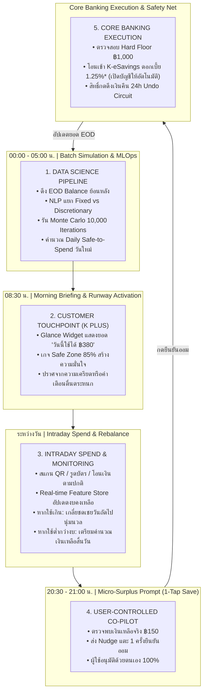
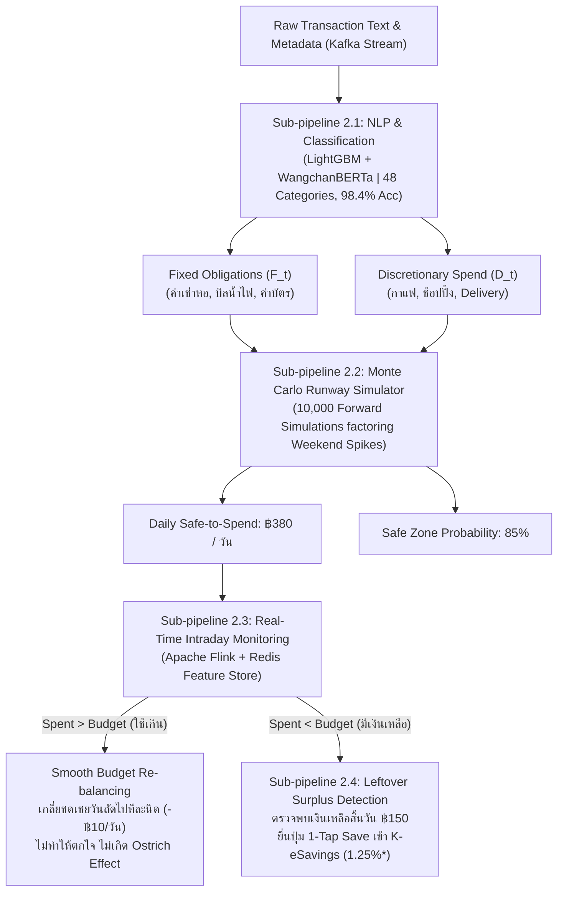
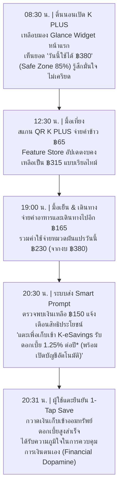

# เอกสารขั้นตอนการทำงานของระบบทั้งหมด (End-to-End System & Data Science Workflow)
## โครงการ K-Runway & Predictive Auto-Saving (K PLUS Innovation)
> **สำหรับ:** การแข่งขัน KBTG Hackathon  
> **หัวข้อ:** ขั้นตอนการทำงานครบวงจรในมุมมอง Data Science, Product UX, Core Banking และ Compliance

---

## สารบัญ
1. [ภาพรวมขั้นตอนการทำงานของระบบ (End-to-End Workflow Architecture)](#1-ภาพรวมขั้นตอนการทำงานของระบบ-end-to-end-workflow-architecture)
2. [ขั้นตอนการทำงานในมุมมองวิทยาการข้อมูล (Data Science & AI Engine Workflow)](#2-ขั้นตอนการทำงานในมุมมองวิทยาการข้อมูล-data-science--ai-engine-workflow)
   - 2.1 Data Ingestion & Transaction Classification (NLP + Multi-Class 48 หมวดหมู่)
   - 2.2 Probabilistic Cash-Flow Runway & Monte Carlo Simulation (10,000 สถานการณ์)
   - 2.3 อัลกอริทึม Smooth Budget Re-balancing (การเกลี่ยชดเชยงบแบบนุ่มนวล)
   - 2.4 Leftover Surplus Detection & Least-Disruptive Intervention (LDI)
   - 2.5 Cold Start Bayesian Protocol (การเริ่มต้นทันทีสำหรับบัญชีใหม่)
3. [ขั้นตอนการทำงานในมุมมองผู้ใช้งานและผลิตภัณฑ์ (Product & UX Customer Journey)](#3-ขั้นตอนการทำงานในมุมมองผู้ใช้งานและผลิตภัณฑ์-product--ux-customer-journey)
   - 3.1 ไทม์ไลน์ 24 ชั่วโมงของ First Jobber (Daily Operational Cycle)
   - 3.2 ปรัชญา Co-pilot: ทำไม 1-Tap Manual Confirmation ถึงชนะ Auto-Debit อัตโนมัติ
4. [ขั้นตอนการทำงานในมุมมองวิศวกรรมระบบและการเงิน (Core Banking & Engineering Workflow)](#4-ขั้นตอนการทำงานในมุมมองวิศวกรรมระบบและการเงิน-core-banking--engineering-workflow)
   - 4.1 กลไกป้องกันการทำธุรกรรมซ้ำซ้อน (Idempotency & Concurrency Lock)
   - 4.2 ระบบคุ้มกันสภาพคล่อง Hard Floor ฿1,000 (Liquidity Shield Enforcement)
   - 4.3 ระบบดึงเงินกลับทันทีและ 24h Reverse Sweep Undo Circuit
5. [ขั้นตอนการทำงานในมุมมองการกำกับดูแลและความเสี่ยง (Risk, Governance & PDPA)](#5-ขั้นตอนการทำงานในมุมมองการกำกับดูแลและความเสี่ยง-risk-governance--pdpa)
   - 5.1 เกณฑ์การคุ้มครองผู้บริโภคของธนาคารแห่งประเทศไทย (BOT Market Conduct)
   - 5.2 มาตรฐานความยินยอมตาม พ.ร.บ. คุ้มครองข้อมูลส่วนบุคคล (PDPA Compliance)

---

## 1. ภาพรวมขั้นตอนการทำงานของระบบ (End-to-End Workflow Architecture)

กระบวนการทำงานของ K-Runway ทำงานสอดประสานกันตลอด 24 ชั่วโมงในลักษณะวงรอบปิด (Closed-Loop Operational Feedback):

---

## 2. ขั้นตอนการทำงานในมุมมองวิทยาการข้อมูล (Data Science & AI Engine Workflow)

วิทยาการข้อมูลคือแกนกลางของระบบ โดยแบ่งกระบวนการเป็น 5 อัลกอริทึมย่อยที่ทำงานร่วมกัน:

---

### 2.1 Data Ingestion & Transaction Classification (NLP + Multi-Class 48 หมวดหมู่)

#### 1. Input Features & Preprocessing:
ระบบรับข้อมูลธุรกรรมจาก Kafka `kplus.tx.events` ผ่านกระบวนการทำความสะอาดข้อความ:
- **Tokenization:** ตัดคำภาษาไทย/อังกฤษ ผสมด้วยโมเดลเฉพาะทางสำหรับสลิปธนาคาร (Custom Financial Dictionary)
- **Feature Extraction:** 
  - Merchant Category Code (MCC)
  - Time-of-day (ช่วงเวลาที่จ่าย) และ Day-of-week (วันในสัปดาห์)
  - Recurrence Interval (รอบความถี่ในการจ่าย เช่น เกิดขึ้นทุกๆ 28-31 วัน)
  - Amount Normalized Vector (ขนาดของยอดเงินเทียบกับประวัติเฉลี่ย)

#### 2. Classification Architecture:
- ใช้โมเดล **Ensemble LightGBM + Fine-tuned Bi-Encoder Transformer (WangchanBERTa Base)**
- จำแนกออกเป็น **48 หมวดหมู่ย่อย** (Sub-categories) ด้วย Benchmark Accuracy **98.4%** และ F1-Score **0.981**
- **Binary Obligation Split:** โมเดลจะแปลงผลลัพธ์ออกเป็น 2 หมวดใหญ่:
  1. **Fixed Obligations ($F_t$):** ค่าใช้จ่ายจำเป็นคงที่ที่ยืดหยุ่นไม่ได้ (Inflexible) เช่น ค่าเช่าห้อง, ค่าผ่อนชำระ, ประกัน, ค่าน้ำไฟ
  2. **Discretionary Spend ($D_t$):** ค่าใช้จ่ายผันแปรในชีวิตประจำวัน (Flexible) เช่น กาแฟ, อาหาร, ช้อปปิ้งออนไลน์, สังสรรค์

---

### 2.2 Probabilistic Cash-Flow Runway & Monte Carlo Simulation

ระบบไม่คำนวณแบบค่าเฉลี่ยเส้นตรง (Linear Average) เพราะค่าใช้จ่ายมนุษย์มีความผันผวนสูง (High Variance โดยเฉพาะวันหยุดสุดสัปดาห์)

#### 1. Mathematical Formulation ของการจำลองกระแสเงินสด:
ยอดเงินคงเหลือ ณ วันที่ $t$ ใดๆ ในอนาคต ($B_t$) คำนวณจาก:

$$B_t = B_{t-1} - F_t - D_t + I_t$$

โดยที่:
- $B_{t-1}$: ยอดเงินคงเหลือวันก่อนหน้า
- $F_t$: ค่าใช้จ่ายคงที่ตามรอบปฏิทิน (Fixed Scheduled Payments)
- $I_t$: รายได้ตามรอบเงินเดือน (Income Inflow)
- $D_t \sim \text{LogNormal}(\mu_{\text{dow}}, \sigma_{\text{dow}}^2)$: ค่าใช้จ่ายกินใช้วันนั้น ซึ่งแจกแจงแบบ Log-Normal และมีค่าน้ำหนักตามวันในสัปดาห์ (วันศุกร์-เสาร์-อาทิตย์ มีค่า $\mu$ สูงกว่าวันธรรมดา 1.45 เท่า)

#### 2. Monte Carlo 10,000 Iterations:
ระบบจำลองเส้นทางเดินเงินสดไปข้างหน้าจนถึงวันเงินเดือนออก ($T_{\text{payday}}$) จำนวน 10,000 ครั้ง:
- **Safe Zone Probability (%):** อัตราส่วนของจำนวนเส้นทางที่เงินไม่หมดก่อนวันเงินเดือนออก โดยยังคงเหลือเงินสูงกว่า Hard Floor ฿1,000:

$$\text{Safe Zone \%} = \frac{1}{10,000} \sum_{k=1}^{10,000} \mathbb{I}\left(\min_{t \in [1, T]} B_t^{(k)} \ge ฿1,000\right) \times 100\%$$

- **Daily Safe-to-Spend ($Budget_{\text{daily}}$):** งบประมาณรายวันที่ช่วยควบคุมให้โอกาสความสำเร็จ (Safe Zone) อยู่ในระดับเป้าหมาย $\ge 85\%$*:

$$Budget_{\text{daily}} = \frac{B_{\text{current}} - \sum_{t=1}^{T} F_t - ฿1,000 (\text{Hard Floor})}{T_{\text{remaining days}}}$$

---

### 2.3 อัลกอริทึม Smooth Budget Re-balancing (การเกลี่ยชดเชยงบแบบนุ่มนวล)

เมื่อผู้ใช้ใช้จ่ายเกินงบประจำวัน (Overspending) แอปการเงินทั่วไปมักแสดงแถบสีแดง แจ้งเตือนว่า "งบแตก" หรือ "เงินจะหมดสิ้นเดือน" ซึ่งงานวิจัย Behavioral Finance ระบุว่าสร้าง **Ostrich Effect (พฤติกรรมนกกระจอกเทศฝังหัวในทราย)** คือผู้ใช้จะตกใจ เครียด และปิดแอปหนี ไม่เปิดดูอีกเลย

**วิธีแก้ปัญหาของ K-Runway (Smooth Budget Re-balancing):**
เมื่อผู้ใช้ใช้จ่ายเกินงบในวันปัจจุบัน เป็นจำนวน $\Delta S$:

$$\Delta S = Spent_{\text{today}} - Budget_{\text{daily}} \quad (\text{เมื่อ } \Delta S > 0)$$

แทนที่จะตัดงบของวันรุ่งขึ้นจนเหลือศูนย์ ระบบจะทำการ**เกลี่ยชดเชยแบบกระจายตัวเบาบาง (Diffused Amortization)** ไปยังวันที่เหลือทั้งหมดจนถึงวันเงินเดือนออก ($N_{\text{remaining}}$):

$$Budget_{\text{new}} = Budget_{\text{old}} - \frac{\Delta S}{N_{\text{remaining}}}$$

**ตัวอย่างสถานการณ์จริง:**
- วันนี้มีงบ ฿380 แต่ต้องไปเลี้ยงวันเกิดเพื่อน จึงจ่ายไป ฿500 (เกินงบ ฿120)
- ยังเหลือเวลาอีก 12 วันก่อนเงินเดือนออก
- ระบบจะไม่แจ้งเตือนด่าผู้ใช้ แต่จะคำนวณปรับงบของ 12 วันที่เหลือลงเพียงวันละ $\frac{฿120}{12} = ฿10$ ต่อวัน
- ในวันถัดไป ยอด Safe-to-Spend จะแสดงเป็น **฿370/วัน** อย่างสงบและนุ่มนวล ผู้ใช้ปรับพฤติกรรมได้จริงโดยคุณภาพชีวิตไม่พังทลาย

---

### 2.4 Leftover Surplus Detection & Least-Disruptive Intervention (LDI)

#### 1. End-of-Day Surplus Isolation (ตรวจจับเงินเหลือจริง):
ณ เวลา 20:30 น. ของทุกวัน ระบบจะตรวจสอบยอดใช้จ่ายสะสมของวัน:

$$Surplus_{\text{leftover}} = \max\left(0, Budget_{\text{daily}} - Spent_{\text{today}}\right)$$

หากผู้ใช้มีงบ ฿380 แต่ใช้จ่ายไปจริงเพียง ฿230 ระบบจะตรวจพบเงินเหลือจริง **฿150.00** โดยเงินก้อนนี้เป็นเงินส่วนเกินที่ถูกพิสูจน์แล้วว่าไม่กระทบต่อค่าเช่าหอพักและภาระผูกพันใดๆ ในอนาคต

#### 2. Least-Disruptive Intervention (LDI Engine):
หากสถานะ Safe Zone ของผู้ใช้ลดลงต่ำกว่า 80% LDI Engine จะทำการคำนวณหาสิ่งที่ตัดแล้วกระทบชีวิตน้อยที่สุด:
- ค้นหา Sub-category ที่มีความยืดหยุ่นสูง (High Price Elasticity & High Discretionary) เช่น หมวด Food Delivery หรือ คาเฟ่/ชานม
- คำนวณคำแนะนำเชิงตัวเลขที่จับต้องได้: *"ลด Food Delivery ลง ฿80/วัน ดัน Safe Zone กลับสู่ 92% โดยไม่ต้องงดกินข้าวนอกบ้าน"*

---

### 2.5 Cold Start Bayesian Protocol (การเริ่มต้นทันทีสำหรับบัญชีใหม่)

สำหรับ First Jobbers ที่เพิ่งรับเงินเดือนก้อนแรก และยังไม่มี Transaction Ledger ใน K PLUS:
1. **Prior Distribution:** ดึงค่ามัธยฐานของกลุ่มประชากร First Jobber (Age 21-25, Salary ฿20,000 - ฿30,000) จากฐานข้อมูลสถิติภาพรวมของ KBank
2. **Likelihood Update จาก 4 คำถาม Quick-Select Pills (ไม่ถามว่าใช้จ่ายวันละเท่าไร เพื่อลด Cognitive Load):**
   - **วันเงินเดือนออก (Payday):** วันที่ 25 หรือ สิ้นเดือน (กำหนดขอบเขต $T_{\text{payday}}$)
   - **ช่วงรายได้สุทธิ (Net Income):** เลือกช่วง เช่น ฿20,000 - ฿28,000 (ประมาณการ inflow $I$)
   - **ภาระค่าใช้จ่ายคงที่ (Fixed Debts/Rent):** เช่น ค่าเช่าห้อง, ค่าเดินทาง, หนี้ กยศ. ($F_{\text{stated}}$)
   - **ความสม่ำเสมอของรายได้ (Income Stability):** เงินเดือนประจำ หรือ มีฟรีแลนซ์เสริม (ใช้ปรับ Prior Variance $\sigma^2$)
3. **Posterior Calibration:**
   - ตั้งค่าเริ่มต้นทันที: $Budget_{\text{init}} = \frac{I - F_{\text{stated}} - \text{Buffer (15\%)}}{30}$
   - เมื่อผู้ใช้เริ่มทำรายการผ่าน K PLUS (สแกน QR, โอนเงิน) ระบบจะใช้ **Kalman Filter / Online Bayesian Updating** เพื่อปรับค่า Parameter ของบุคคลนั้นๆ ให้แม่นยำขึ้นเรื่อยๆ ภายใน 14 วันแรก

---

## 3. ขั้นตอนการทำงานในมุมมองผู้ใช้งานและผลิตภัณฑ์ (Product & UX Customer Journey)

### ปรัชญา Co-pilot: ทำไม 1-Tap Manual Confirmation ถึงชนะ Auto-Debit อัตโนมัติ?

| มิติการเปรียบเทียบ | ระบบหักเงินอัตโนมัติ (Autonomous Auto-Debit) | ระบบ Co-pilot 1-Tap Confirmation (K-Runway) |
| :--- | :--- | :--- |
| **ความรู้สึกของผู้ใช้** | รู้สึกสูญเสียการควบคุม (Loss of Autonomy), กลัวเงินหาย | รู้สึกมีอำนาจตัดสินใจ (Empowerment & Self-Efficacy) |
| **พฤติกรรมตอบสนอง** | ตกใจเมื่อเห็นเงินถูกหัก แล้วกดถอนเงินกลับออกมาใช้ทันที | รู้สึกภูมิใจที่ประหยัดเงินได้ และตั้งใจกดยืนยันออมด้วยตัวเอง |
| **ความเสี่ยง Overdraft** | สูง หากมีบิลฉุกเฉินหักซ้อนเวลาเดียวกัน | ศูนย์ (Zero Risk) เพราะผู้ใช้เป็นผู้ตรวจสอบจังหวะชีวิตตัวเอง |
| **ความสอดคล้องกับ ธปท.** | เสี่ยงต่อข้อร้องเรียนเรื่องการตัดเงินโดยไม่ได้รับอนุญาต | ผ่านเกณฑ์ Bounded Consent 100% โปร่งใส ตรวจสอบได้ |

---

## 4. ขั้นตอนการทำงานในมุมมองวิศวกรรมระบบและการเงิน (Core Banking & Engineering Workflow)

### 4.1 กลไกป้องกันการทำธุรกรรมซ้ำซ้อน (Idempotency & Concurrency Lock)
เมื่อผู้ใช้กดยืนยัน 1-Tap Sweep:
1. Client สร้าง `idempotency_key` ที่เกิดจาก `SHA256(customer_token + date + surplus_amount)`
2. `savings-sweep-engine` ดึง Distributed Lock ผ่าน **Redis Redlock** ด้วยคีย์ดังกล่าว
3. หากมีคำสั่งส่งซ้ำ (เช่น ผู้ใช้กดเบิ้ล หรือเครือข่ายกระตุก) ระบบจะส่งคืน Response เดิมโดยไม่มีการตัดเงินรอบสองเด็ดขาด

### 4.2 ระบบคุ้มกันสภาพคล่อง Hard Floor ฿1,000 (Liquidity Shield Enforcement)
ก่อนส่งคำสั่งโอนเงินไปยัง Core Banking:

$$\text{Available Balance After Sweep} \ge ฿1,000.00$$

หากผลการคำนวณพบว่าเงินในบัญชีหลักจะเหลือต่ำกว่า ฿1,000 (เช่น มีรายการหักบัญชีอื่นตัดเข้ามาก่อนหน้าเสี้ยววินาที) **ระบบจะปฏิเสธคำสั่งออมทันทีโดยอัตโนมัติ (Safe Fail)** และแจ้งผู้ใช้ว่าคงเงินไว้เพื่อความปลอดภัย

### 4.3 ระบบดึงเงินกลับทันทีและ 24h Reverse Sweep Undo Circuit
- ภายใน 24 ชั่วโมงหลังจากการกดยืนยันออมเงิน หากผู้ใช้เกิดเหตุฉุกเฉินต้องใช้เงิน จะมีปุ่ม **"ดึงเงินกลับ (Undo)"** บนหน้า Dashboard
- การกดปุ่มนี้จะส่งคำสั่ง Reverse Internal Transfer ย้ายเงินจาก K-eSavings กลับเข้า Checking ทันทีใน 1 วินาที โดยไม่เสียค่าธรรมเนียมและไม่เสียประวัติ ทำให้ผู้ใช้รู้สึกอุ่นใจ 100% ที่จะออมเงิน

---

## 5. ขั้นตอนการทำงานในมุมมองการกำกับดูแลและความเสี่ยง (Risk, Governance & PDPA)

### 5.1 เกณฑ์การคุ้มครองผู้บริโภคของธนาคารแห่งประเทศไทย (BOT Market Conduct)
- **Non-Coercive User Interface:** ออกแบบ UI ปราศจาก Dark Patterns ไม่มีการติ๊กถูกล่วงหน้า ไม่มีการบังคับโอน และไม่มีการคิดค่าธรรมเนียมแอบแฝง
- **Clear Information Disclosure:** แสดงอัตราดอกเบี้ยบัญชีปลายทาง (K-eSavings 1.25% ต่อปี* สำหรับยอดไม่เกิน ฿500,000) และเงื่อนไขการถอนอย่างชัดเจนในหน้ากดยืนยัน
- **Overdraft Protection:** มาตรการ Hard Floor (฿1,000) และ Smooth Re-balancing ช่วยป้องกันไม่ให้บัญชีติดลบหรือโดนค่าปรับจากการตัดบัญชีไม่ผ่าน

### 5.2 มาตรฐานความยินยอมตาม พ.ร.บ. คุ้มครองข้อมูลส่วนบุคคล (PDPA Compliance)
- **Purpose Limitation:** ข้อมูลธุรกรรมถูกนำมาประมวลผลเพื่อการบริหารสภาพคล่องส่วนบุคคลของเจ้าของบัญชีเท่านั้น โดยไม่มีการส่งต่อข้อมูลให้แก่ Third-party หรือคู่ค้าภายนอก
- **Consent Audit Trail:** ทุกการกดยืนยันออมเงินจะถูกบันทึกลงในตาราง `SWEEP_CONSENT_AUDIT` พร้อมเก็บ Hash ลายเซ็นดิจิทัลของ Session เพื่อเป็นหลักฐานทางกฎหมายว่าผู้ใช้เป็นผู้ริเริ่มคำสั่งด้วยตนเอง
- **Right to Opt-out:** ผู้ใช้งานสามารถเปิด/ปิดฟังก์ชัน K-Runway และ Daily Nudge ได้ตลอดเวลาผ่านเมนู Settings ใน K PLUS

---

## สรุปภาพรวมคุณค่าของโซลูชัน (Value Proposition Summary)

1. **สำหรับ First Jobbers:** เปลี่ยนความกังวล "เงินจะพอถึงสิ้นเดือนไหม" ให้กลายเป็น "ความมั่นใจรายวัน" ผ่านยอดเงินที่ใช้ได้จริง ไม่ต้องจดบัญชีเอง และสร้างเงินออมก้อนแรกในชีวิตได้สำเร็จโดยไม่เสียการควบคุม
2. **สำหรับ KBank & KBTG:** เพิ่มความผูกพันของลูกค้ากับแอป K PLUS (Daily Active Engagement), เพิ่มยอดเงินฝากคงค้างต้นทุนต่ำ (Low-Cost CASA Stickiness) และแสดงความเป็นผู้นำด้าน AI & Data Science ระดับแนวหน้าของประเทศไทย
